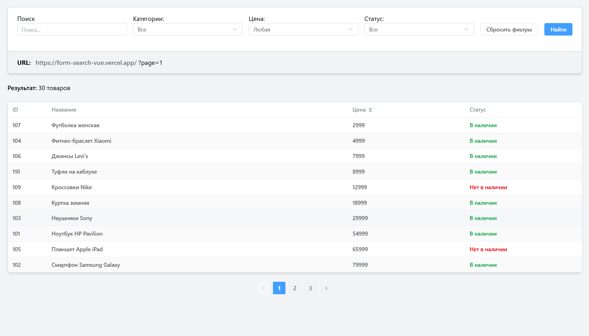

# Фильтр товаров с динамическим URL

Простой интернет-магазин с фильтрацией, пагинацией и синхронизацией состояния с
URL. Сделан на Vue 3 + Pinia + Element Plus.

## О проекте

Интерфейс для просмотра и фильтрации каталога товаров. Фильтры по категориям,
цене, наличию, поиск по названию и сортировка — всё работает как единое целое.
Состояние фильтров сохраняется в URL, так что можно поделиться ссылкой с
конкретным набором фильтров.

## Зачем я это сделал

Хотел на реальном примере разобраться со связкой Vue 3 Composition API + Pinia и
синхронизацией состояния с URL. Интересно было попробовать TypeScript во Vue,
посмотреть как работает Element Plus и Tailwind вместе. Ну и заодно пощупать
Vite.

## Функционал

- Просмотр списка товаров с пагинацией
- Фильтрация по категориям (из отдельного API)
- Фильтр по ценовому диапазону
- Фильтр по наличию (в наличии / нет / все)
- Поиск по названию
- Сортировка по цене (по возрастанию/убыванию)
- Сброс всех фильтров
- Состояние фильтров в URL — можно скопировать ссылку
- Адаптивный дизайн (Tailwind)

## Архитектура / Особенности реализации

В целом старался разделить логику и представление.

**Хранилища (stores):**

- `products` — товары, пагинация, сортировка, загрузка
- `filters` — состояние фильтров, доступные категории и цены

**Composables:**

- `useUrl` — синхронизация фильтров с URL. Самое интересное место: смотрю за
  изменениями фильтров и обновляю URL через `history.replaceState`, при загрузке
  парсю URL и выставляю начальные значения.

**API:**

- Vercel serverless functions (`/api/products`, `/api/filters`) — читают данные
  из `db.json`. Обычно на dev использовал прокси, но для деплоя пришлось вынести
  в функции.

Из необычного — в `db.json` данные разбиты на товары и фильтры. Фильтры
подгружаются отдельно, чтобы не хардкодить категории.

## Стек

- **Vue 3** (Composition API, `<script setup>`)
- **Pinia** — стейт-менеджмент
- **TypeScript** — типизация пропсов, сторов, ответов API
- **Element Plus** — готовая таблица, селекты, пагинация, уведомления
- **Tailwind CSS** — стилизация
- **Vite** — сборка
- **Pug** — шаблоны (да, мне так удобнее)
- **Vercel** — деплой и serverless functions
- **Json-server** - был изначально, но из-за деплоя на Vercel пришось его убрать

## Как запустить

```bash
# Клонировать репозиторий
git clone https://github.com/B1ZON-c0de/form-search-vue.git

# Установить зависимости
npm install

# Запустить дев-сервер
npm run dev

# Собрать для продакшна
npm run build
```

По умолчанию дев-сервер проксирует запросы к `/api` на `localhost:3000`. Если
хочешь тестировать локально без Vercel — можно поднять любой сервер, который
отдаёт `db.json`, или просто закомментировать прокси в `vite.config.ts` и
замокать данные.

Для деплоя на Vercel всё уже настроено (`vercel.json`):

- API роуты идут в `/api/*.js`
- Статика собирается и отдаётся как SPA

## Что можно улучшить

- Вынести типы в общую папку, а не по файлам
- Кэширование ответов API на клиенте
- Сделать более умную синхронизацию с URL — сейчас на каждый чих фильтров
  обновляется URL
- Мобильная версия: фильтры хорошо бы прятать в выдвижную панель

##  Сриншоты

